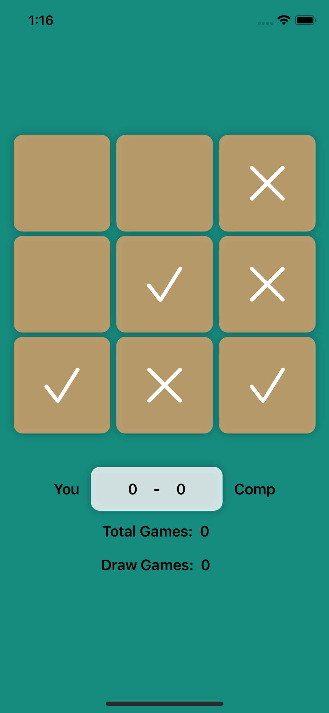

# tic-tac-toe-SwiftUI

tic-tac-toe-SwiftUI is simple game developed using SwiftUI and MVVM. This is a stater project for learning. if you're a beginer and want to deleop small project specially in MVVM then this project is super simple and help you to get started. :slightly_smiling_face:

:e-mail:  ahmed.naqeeb108@gmail.com

connect via LinkedIn: https://www.linkedin.com/in/naqeeb-ahmed-7ba469128 

